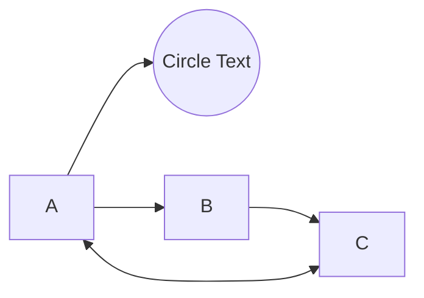
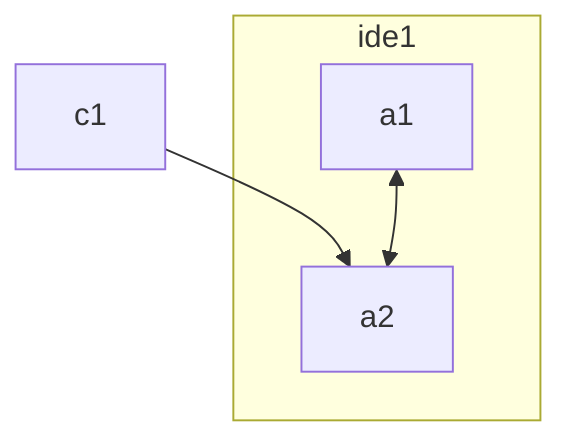
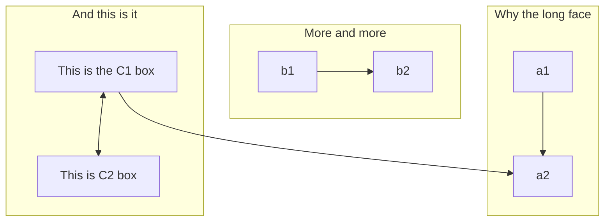
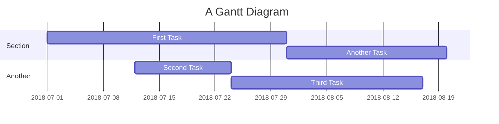

```mermaid
flowchart LR;
    id1((Circle Text))
    A-->id1;
    A-->B;
    B-->C;
    A<-->C;
```


```mermaid
flowchart TB;
    c1-->a2;
    subgraph ide1;
    a1<-->a2;
    end
```



```mermaid
flowchart TB
    c1["This is the C1 box"]
    c1-->a2
    subgraph "Why the long face"
    a1-->a2
    end
    subgraph "More and more"
    b1-->b2
    end
    subgraph "And this is it"
    c2["This is C2 box"]
    c1<-->c2
    end
```


```mermaid
gantt
    title A Gantt Diagram
    dateFormat  YYYY-MM-DD
    section Section
    First Task       :a1, 2018-07-01, 30d
    Another Task     :after a1, 20d
    section Another
    Second Task      :2018-07-12, 12d
    Third Task       : 24d
```

```PowerShell
If ((test-path $outputFile) -eq "True") {Remove-Item $outputFile -force}
```
